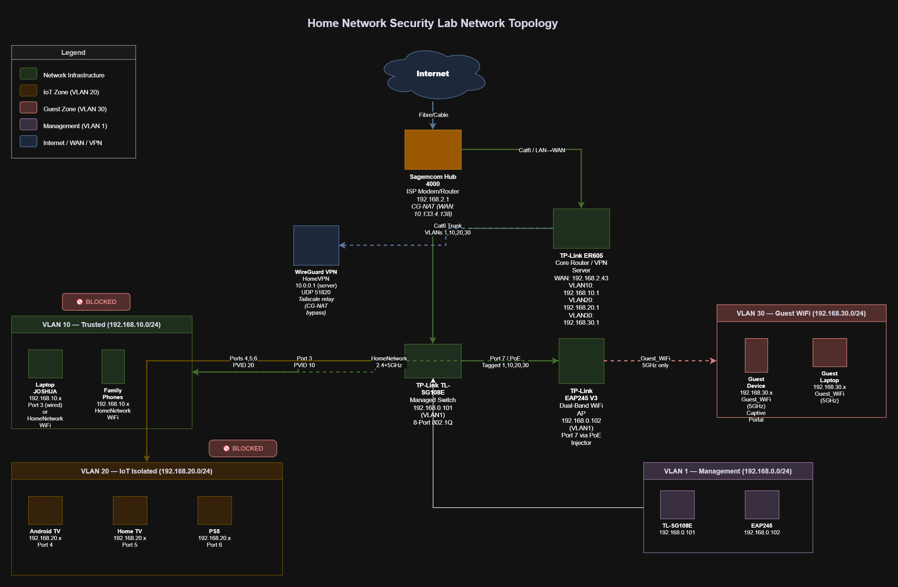

# Home Network Security Lab

**Author:** Segun Olawunmi — Cybersecurity Analyst 

---

## Overview

This project documents the design and implementation of an enterprise-grade segmented home network built for both practical security and portfolio demonstration purposes. The lab demonstrates real-world network segmentation, firewall policy enforcement, wireless security, and VPN configuration using consumer/prosumer hardware.

---

## Hardware

| Device | Model | IP Address | Role |
|--------|-------|------------|------|
| ISP Modem | Sagemcom Hub 4000 | 192.168.2.1 | ISP gateway (CG-NAT) |
| Router | TP-Link ER605 | 192.168.10.1 / 192.168.0.1 | Core router, VLAN gateway, VPN server |
| Switch | TP-Link TL-SG108E | 192.168.0.101 | Managed 8-port switch |
| Access Point | TP-Link EAP245 V3 | 192.168.0.102 | Dual-band WiFi AP |

**ISP:** Virgin Plus (Bell Canada) — 580 Mbps down, CG-NAT confirmed

---

## Network Architecture

### VLAN Design

| VLAN | Name | Subnet | Purpose |
|------|------|--------|---------|
| 1 | Management | 192.168.0.0/24 | Switch and AP management |
| 10 | Trusted | 192.168.10.0/24 | Family devices, laptops, phones |
| 20 | IoT_Isolated | 192.168.20.0/24 | Android TV, Smart TV, PS5, IoT devices |
| 30 | Guest_WiFi | 192.168.30.0/24 | Visitors, untrusted devices |

### Network Topology Diagram



### Network Topology (Text)

```
Virgin Plus → Hub 4000 (192.168.2.1)
                  ↓ LAN (Cat6)
             ER605 WAN port
                  ↓ LAN port 1 (Cat6 trunk)
             TL-SG108E Switch
          ↓           ↓          ↓         ↓
       Port 3      Port 4    Port 5    Port 7
      Laptop/     Android   Home TV   PoE Injector
      Trusted       TV               → EAP245 AP
      (VLAN10)   (VLAN20)  (VLAN20)
                              ↓
                           Port 6
                            PS5
                          (VLAN20)
```

---

## Security Model

**Principle:** Least privilege network access. Each zone gets only what it needs.

| Zone | Internet | Trusted Access | IoT Access | Guest Access |
|------|----------|----------------|------------|--------------|
| Trusted (VLAN10) | ✅ | ✅ | ❌ | ❌ |
| IoT (VLAN20) | ✅ | ❌ | ✅ | ❌ |
| Guest (VLAN30) | ✅ | ❌ | ❌ | ❌ |

Firewall rules enforce zero lateral movement between zones. IoT and Guest devices get internet access only.

---

## WiFi SSIDs

| SSID | Band | VLAN | Security |
|------|------|------|----------|
| HomeNetwork | 2.4GHz + 5GHz | VLAN 10 | WPA2-PSK |
| IoT_Isolated | 2.4GHz + 5GHz | VLAN 20 | WPA2-PSK |
| Guest_WiFi | 5GHz only | VLAN 30 | Captive Portal |

---

## VPN

WireGuard VPN server configured on the ER605 for encrypted remote access. CG-NAT from Virgin Plus prevents direct external connections — Tailscale used as a relay for remote access.

---

## Verification

VLAN isolation was verified using ping tests across all zone boundaries:

| Test | From | To | Result |
|------|------|----|--------|
| 1 | Trusted | Internet (8.8.8.8) | ✅ Pass |
| 2 | IoT | Trusted | ✅ Blocked |
| 3 | Guest | IoT | ✅ Blocked |

---

## Repository Structure

```
home-network-security-lab/
├── README.md
├── diagrams/
│   ├── network-topology.png
│   └── network-topology.drawio
├── config/
│   ├── vlan-table.md
│   ├── firewall-rules.md
│   ├── switch-port-config.md
│   └── vpn-setup.md
├── threat-model/
│   └── threat-model.md
├── verification/
│   └── test-results.md
└── screenshots/
    ├── 02_er605_system_status_wan_connected.png
    ├── 03_er605_lan_network_list_default.png
    ├── 04_er605_vlan10_trusted_form.png
    ├── 05_er605_vlan10_trusted_created.png
    ├── 06_er605_vlan20_iot_isolated_form.png
    ├── 07_er605_vlan30_guest_wifi_form.png
    ├── 08_er605_all_vlans_created.png
    ├── 09_er605_vlan_ports_tab.png
    ├── 10_er605_vlan_list.png
    ├── 11_er605_access_control_empty.png
    ├── 12_er605_rule1_block_iot_to_trusted_form.png
    ├── 13_er605_rule1_saved.png
    ├── 14_er605_rule2_block_guest_to_trusted_form.png
    ├── 15_er605_rules_1_and_2_saved.png
    ├── 16_er605_rule3_block_guest_to_iot_form.png
    ├── 17_er605_rules_1_2_3_saved.png
    ├── 18_er605_rule4_block_iot_to_guest_form.png
    ├── 19_er605_all_firewall_rules_complete.png
    ├── 20_er605_dhcp_client_list_switch_found.png
    ├── 21_sg108e_system_info.png
    ├── 22_sg108e_8021q_vlan_disabled.png
    ├── 23_sg108e_8021q_vlan_enabled.png
    ├── 23b_switch_port_plan_sketch.jpg
    ├── 24_sg108e_vlan10_trusted_created.png
    ├── 25_sg108e_vlan20_iot_created.png
    ├── 26_sg108e_pvid_before.png
    ├── 27_sg108e_pvid_settings_complete.png
    ├── 29_er605_dhcp_all_devices.png
    ├── 33_eap245_dashboard_laptop.png
    ├── 34_eap245_wireless_settings.png
    ├── 35_eap245_homenetwork_ssid_created.png
    ├── 36_eap245_homenetwork_5ghz_created.png
    ├── 37_eap245_iot_isolated_both_bands.png
    ├── 38_eap245_5ghz_all_three_ssids.png
    ├── 39_eap245_vlan_assignments.png
    ├── 40_sg108e_vlan30_guest_created.png
    ├── 41_sg108e_all_vlans_final.png
    ├── 43_er605_wireguard_empty.png
    ├── 44_er605_wireguard_server_created.png
    ├── 46_er605_wireguard_peer_josh_phone.png
    └── 48_hub4000_port_forwarding_wireguard.png
```

---

## Screenshot Documentation

All configuration steps are documented with screenshots in the `screenshots/` folder. Key screenshots:

| Screenshot | Description |
|------------|-------------|
| 02 | ER605 WAN connected — IP 192.168.2.43 |
| 08 | All 4 VLANs created on ER605 |
| 19 | All 4 firewall isolation rules complete |
| 23b | Hand-drawn switch port plan (planning phase) |
| 27 | Switch PVID settings complete |
| 39 | EAP245 VLAN assignments — SSIDs mapped to VLANs 10/20/30 |
| 41 | Switch final VLAN config — all 4 VLANs with Port 7 trunk |
| 46 | WireGuard peer handshake active — 97MB TX confirmed |
| 48 | Hub 4000 port forwarding — UDP 51820 → ER605 |

---

## Skills Demonstrated

- Network segmentation with 802.1Q VLANs
- Firewall ACL policy design and implementation
- Managed switch configuration (trunk/access ports, PVID)
- Wireless security zones and captive portal
- WireGuard VPN server deployment
- CG-NAT traversal with Tailscale
- Network documentation and threat modelling
